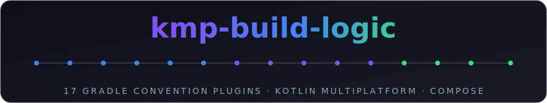
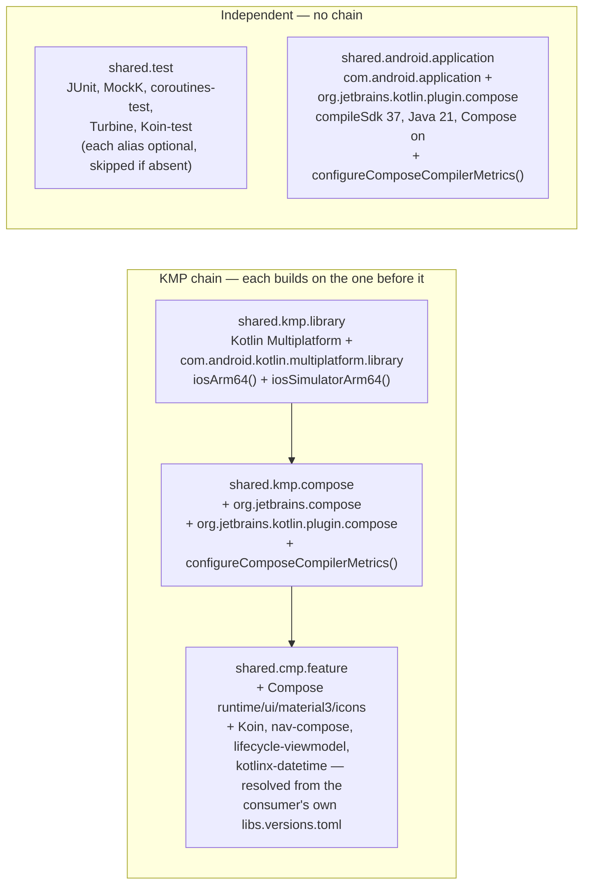

<div align="center">



### Shared Gradle convention plugins for Kotlin Multiplatform + Compose Multiplatform projects — write the module config once, apply it with one line everywhere.


</div>

---

## Why this exists

Every KMP + Compose Multiplatform module ends up re-declaring the same boilerplate: apply Kotlin
Multiplatform, apply the AGP KMP-library plugin, declare the iOS targets, wire the Compose compiler,
pull in the same Koin/lifecycle/navigation baseline for feature modules. Copy-pasting that across
modules — or across *repos* — is exactly the kind of drift a convention plugin exists to kill.

This repo extracts that shared surface out of two production KMP codebases into a standalone,
independently-buildable Gradle composite build: five convention plugins under a neutral `shared.*`
prefix, plus the Compose-compiler-metrics wiring they share. Anything that genuinely diverged between
the source repos (Android-only library defaults, repo-specific desktop/watchOS targets) was left out
on purpose — see [What's deliberately not here](#whats-deliberately-not-here).

## Plugin map

| Plugin ID | Class | Configures |
|---|---|---|
| `shared.kmp.library` | `SharedKmpLibraryConventionPlugin` | Kotlin Multiplatform + AGP KMP-library plugins, `iosArm64()` + `iosSimulatorArm64()` targets |
| `shared.kmp.compose` | `SharedKmpComposeConventionPlugin` | `shared.kmp.library` + Compose Multiplatform + Compose compiler plugins, Compose-metrics wiring |
| `shared.cmp.feature` | `SharedCmpFeatureConventionPlugin` | `shared.kmp.compose` + the standard feature-module dep set (Compose runtime/UI/Material3, Koin, JetBrains navigation-compose, lifecycle-viewmodel, kotlinx-datetime) in `commonMain`/`androidMain` |
| `shared.test` | `SharedTestConventionPlugin` | JVM unit-test stack on `testImplementation`: JUnit, MockK, coroutines-test, Turbine, Koin-test |
| `shared.android.application` | `SharedAndroidApplicationConventionPlugin` | AGP application + Compose-compiler plugins, `compileSdk 37` / Java 21 / Compose enabled (`buildConfig` off by default) |

Every plugin that applies the Compose compiler (`shared.kmp.compose`, and transitively
`shared.cmp.feature`, plus `shared.android.application` directly) also picks up
`configureComposeCompilerMetrics()`: it always wires the *consumer's* rootProject
`compose_stability.conf` if present, and additionally emits Compose compiler metrics/stability
reports under `build/compose-metrics` + `build/compose-reports` when the consumer build is run with
`-Pcompose.metrics`. `shared.kmp.library` and `shared.test` never call it — neither applies a Compose
compiler plugin, so there's no `ComposeCompilerGradlePluginExtension` for it to configure. See
[`compose_stability.conf`](compose_stability.conf) in this repo for the template — copy it into your
own project root and edit it.

## Plugin composition



## Getting started

Add this repo as a submodule and include it as a composite build:

```bash
git submodule add https://github.com/darkpandawarrior/kmp-build-logic.git external/kmp-build-logic
```

```kotlin
// settings.gradle.kts
pluginManagement {
    includeBuild("external/kmp-build-logic")
    repositories {
        google()
        mavenCentral()
        gradlePluginPortal()
    }
}
```

Apply a plugin in any module's build file:

```kotlin
// core/data/build.gradle.kts
plugins {
    id("shared.kmp.library")
}

android {
    namespace = "com.example.core.data"
    compileSdk = 37
    defaultConfig { minSdk = 24 }
}
```

`shared.cmp.feature` and `shared.test` resolve their library dependencies from **your own** version
catalog (`libs`) via `VersionCatalogsExtension.findLibrary(...)`, so your project's
`gradle/libs.versions.toml` must define the aliases they reference — see the plugin map above and
each plugin's KDoc for the exact alias names. (`shared.kmp.compose` itself only applies Gradle
plugins — Compose Multiplatform + the Compose compiler — it never touches the version catalog;
catalog resolution only happens in `shared.cmp.feature`, which builds on top of it.)

## Tech stack

| Layer | Version |
|---|---|
| Kotlin | 2.4.0 |
| Android Gradle Plugin | 9.2.1 |
| Compose Multiplatform | 1.11.1 |
| Gradle | 9.6.1 |
| JDK | 21 (resolved automatically via the foojay toolchain resolver if not installed) |

## Building standalone

This repo is a self-contained composite build with no consumer project required:

```bash
git clone https://github.com/darkpandawarrior/kmp-build-logic.git
cd kmp-build-logic
./gradlew build
```

## Technical deep dive

- **Binary plugins, not precompiled script plugins.** `convention/build.gradle.kts` applies
  `kotlin-dsl` and registers each plugin explicitly:
  ```kotlin
  gradlePlugin {
      plugins {
          register("kmpLibrary") {
              id = "shared.kmp.library"
              implementationClass = "SharedKmpLibraryConventionPlugin"
          }
          // ...
      }
  }
  ```
  That's a deliberate choice over the *other* common convention-plugin style — precompiled script
  plugins, where a `foo.gradle.kts` file's name is auto-mapped to a plugin ID by the `kotlin-dsl`
  plugin with no explicit registration. Hand-written `Plugin<Project>` classes under
  `src/main/kotlin` (e.g. [`SharedKmpLibraryConventionPlugin.kt`](convention/src/main/kotlin/SharedKmpLibraryConventionPlugin.kt))
  give each plugin real KDoc, an explicit `apply(target: Project)` body, and an ID that's
  independent of the file name.

- **Version-catalog access from plugin code is reflective, not the `libs.xyz` DSL.** Inside a
  module's own `build.gradle.kts`, Gradle generates type-safe `libs.foo` accessors for the version
  catalog. Those accessors don't exist for a binary plugin living in an included build — its class
  is compiled before Gradle knows which project it'll be applied to. So
  [`SharedCmpFeatureConventionPlugin`](convention/src/main/kotlin/SharedCmpFeatureConventionPlugin.kt)
  and [`SharedTestConventionPlugin`](convention/src/main/kotlin/SharedTestConventionPlugin.kt) look
  the catalog up at apply-time instead:
  ```kotlin
  val libs = extensions.getByType<VersionCatalogsExtension>().named("libs")
  libs.findLibrary("koin.core").get()
  ```
  `shared.cmp.feature` calls `.get()` — a missing alias in the consumer's catalog throws
  `NoSuchElementException` at configuration time, by design (its KDoc lists every alias it requires).
  `shared.test` instead wraps each lookup in `.ifPresent { ... }`, so a consumer that doesn't declare
  `turbine` or `koin-test` in its catalog just doesn't get that `testImplementation` line, rather than
  failing the build — see [`SharedTestConventionPlugin.kt`](convention/src/main/kotlin/SharedTestConventionPlugin.kt).

- **`compileOnly` for the plugin classpath, on purpose.** `convention/build.gradle.kts` depends on
  `libs.android.gradlePlugin`, `libs.kotlin.gradlePlugin`, etc. as `compileOnly`, not
  `implementation` — the inline comment spells out why: using `implementation` risks the *same*
  plugin class being loaded by two different classloaders at two different versions (the version this
  build compiles against vs. the version already on the consumer's classpath), which surfaces as a
  `ClassCastException` at apply-time rather than a build-script error.

- **`shared.kmp.library` applies AGP's dedicated KMP-library plugin, not the classic one.**
  [`SharedKmpLibraryConventionPlugin.kt`](convention/src/main/kotlin/SharedKmpLibraryConventionPlugin.kt)
  applies `com.android.kotlin.multiplatform.library` — AGP 9's purpose-built plugin for an
  Android-target inside a `kotlin { }` multiplatform block — rather than the classic
  `com.android.library`, which has no multiplatform source-set awareness.

- **The version catalog is deliberately *not* re-declared in `settings.gradle.kts`.** A comment there
  explains why: this repo's `gradle/libs.versions.toml` already sits at Gradle's conventional path, so
  Gradle auto-registers it as the `libs` catalog. Adding an explicit
  `versionCatalogs { create("libs") { from(...) } }` block — as you'd need if the file lived at a
  non-default path (e.g. one directory level up, the shape used by the two donor repos this build
  logic was extracted from) — fails the build here with a "Multiple `from` invocations" error,
  because the implicit registration already claimed the catalog name.

## Version history

No git tags exist yet (`git tag --sort=-creatordate` returns nothing) — nothing below is a release,
just the commit history to date:

| Date | Commit | Summary |
|---|---|---|
| 2026-07-05 | `f39742e` | `feat:` initial extraction — the five `shared.*` convention plugins + Compose-metrics wiring |
| 2026-07-06 | `f05fe2c` | `chore:` added the commit-message + CI guard against AI-attribution lines |

The repo does carry a `VERSION` file pinned at `1.0.0` and a `BUILD_NUMBER` at `1`, but neither has a
matching git tag cut yet — treat those as pre-declared, not as a shipped release.

## What's deliberately not here

- **`AndroidLibraryConventionPlugin`** — genuinely diverges between the two source repos
  (`minSdk`/Java target differ), so it stays local to each consumer instead of being papered over.
- **`AndroidProviderConventionPlugin`, `KmpLibraryWatchosConventionPlugin`, `KmpDesktopConventionPlugin`**
  — repo-specific targets (a payment-provider module shape, watchOS, JVM desktop) out of scope for a
  shared surface two arbitrary KMP projects would both want.
