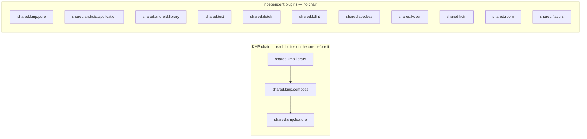

<div align="center">


### Shared Gradle convention plugins for Kotlin Multiplatform + Compose Multiplatform projects — write the module config once, apply it with one line everywhere.

[](https://github.com/darkpandawarrior/kmp-build-logic/actions/workflows/ci.yml)
[](https://github.com/darkpandawarrior/kmp-build-logic/actions/workflows/no-ai-attribution.yml)


**[Why](#why-this-exists)** · **[Features](#features)** · **[Architecture](#architecture)** · **[Tech stack](#tech-stack)** · **[Getting started](#getting-started)** · **[Roadmap](#roadmap)**

**Portfolio:** [cv-siddharth.vercel.app](https://cv-siddharth.vercel.app/) &nbsp;·&nbsp; **Consumers:** [Mileway](https://github.com/darkpandawarrior/Mileway) &nbsp;·&nbsp; [PaymentsLab](https://github.com/darkpandawarrior/PaymentsLab)

</div>

---

<details>
<summary><b>Table of contents</b></summary>

- [Why this exists](#why-this-exists)
- [Features](#features)
- [Architecture](#architecture)
  - [Engineering decisions](#engineering-decisions)
  - [Module map](#module-map)
  - [Project structure](#project-structure)
- [Tech stack](#tech-stack)
- [Getting started](#getting-started)
- [Building standalone](#building-standalone)
- [Roadmap](#roadmap)
- [What's deliberately not here](#whats-deliberately-not-here)

</details>

## Why this exists

Every KMP + Compose Multiplatform module ends up re-declaring the same boilerplate: apply Kotlin
Multiplatform, apply the AGP KMP-library plugin, declare the iOS targets, wire the Compose compiler,
pull in the same Koin/test/quality baseline for every module. Copy-pasting that across modules — or
across *repos* — is exactly the kind of drift a convention plugin exists to kill.

This repo extracts that shared surface out of production KMP codebases into a standalone,
independently-buildable Gradle composite build: 14 convention plugins under a neutral `shared.*`
prefix, plus the Compose-compiler-metrics wiring several of them share. It's consumed today by
[**Mileway**](https://github.com/darkpandawarrior/Mileway) and
[**PaymentsLab**](https://github.com/darkpandawarrior/PaymentsLab) via `includeBuild`, so the
Kotlin/AGP/Compose/quality setup isn't hand-copied per project. Anything that genuinely diverges
between consumers (app-specific flavor lists, repo-specific desktop/watchOS targets) was left out on
purpose — see [What's deliberately not here](#whats-deliberately-not-here).

## Features

| Area | Plugin ID | Configures |
|---|---|---|
| **KMP chain** | `shared.kmp.library` | Kotlin Multiplatform + AGP KMP-library plugins, `iosArm64()` + `iosSimulatorArm64()` |
| | `shared.kmp.compose` | `shared.kmp.library` + Compose Multiplatform + Compose compiler plugins, Compose-metrics wiring |
| | `shared.cmp.feature` | `shared.kmp.compose` + the standard feature-module dep set (Compose runtime/UI/Material3, Koin, JetBrains navigation-compose, lifecycle-viewmodel, kotlinx-datetime) |
| | `shared.kmp.pure` | Kotlin Multiplatform only — `jvm()`, `iosArm64()`, `iosSimulatorArm64()`, `wasmJs { browser(); nodejs() }` — for platform-SDK-free leaf modules |
| **Android** | `shared.android.application` | AGP application + Compose-compiler plugins, `compileSdk 37` / Java 21 / Compose enabled |
| | `shared.android.library` | AGP library + Compose-compiler plugins for an Android-only leaf module, `compileSdk 37` / `minSdk 24` / Java 21, single "release" variant with sources |
| **Testing** | `shared.test` | JVM unit-test stack on `testImplementation`: JUnit, MockK, coroutines-test, Turbine, Koin-test |
| **Quality** | `shared.detekt` | Detekt 2.x static analysis, `buildUponDefaultConfig`, `detekt-formatting` ruleset |
| | `shared.ktlint` | ktlint Gradle plugin with defaults (alternative to `shared.spotless`) |
| | `shared.spotless` | Spotless with ktlint-based Kotlin/Kotlin-script formatting |
| | `shared.kover` | Kover coverage — root project configures filters/verify, every leaf self-registers into the aggregation |
| **DI / data** | `shared.koin` | Koin core DI wired into `commonMain`/`commonTest` for non-Compose modules |
| | `shared.room` | Room 3 (KMP) + KSP, schema export, runtime/compiler wired across Android + iOS targets |
| **Flavors** | `shared.flavors` | `kmp-product-flavors` (Android-style product flavors for KMP) with build-type support |

Every plugin that applies the Compose compiler (`shared.kmp.compose` and transitively
`shared.cmp.feature`, plus `shared.android.application`/`shared.android.library` directly) also
picks up `configureComposeCompilerMetrics()`: it always wires the *consumer's* rootProject
`compose_stability.conf` if present, and additionally emits Compose compiler metrics/stability
reports under `build/compose-metrics` + `build/compose-reports` when run with `-Pcompose.metrics`.
See [`compose_stability.conf`](compose_stability.conf) in this repo for the template.

## Architecture



### Engineering decisions

| Decision | Why | Trade-off |
|---|---|---|
| Binary plugins (`kotlin-dsl` + explicit `gradlePlugin { plugins { register(...) } }`), not precompiled script plugins | Real KDoc, an explicit `apply(target: Project)` body, and a plugin ID independent of the file name | More boilerplate per plugin than a `foo.gradle.kts` auto-mapped ID |
| Version-catalog lookups inside plugin code go through `VersionCatalogsExtension.findLibrary(...)` reflectively, not the generated `libs.xyz` DSL | Type-safe `libs.foo` accessors don't exist for a binary plugin class compiled before Gradle knows which project it applies to | Alias typos surface at configuration time (`NoSuchElementException`), not compile time |
| Plugin-classpath deps (`libs.android.gradlePlugin`, etc.) are `compileOnly`, never `implementation` | Avoids the same plugin class being loaded by two classloaders at two versions — that surfaces as a `ClassCastException` at apply-time, not a build-script error | Every convention plugin author has to remember `compileOnly` |
| `shared.kmp.library` applies AGP's `com.android.kotlin.multiplatform.library`, not classic `com.android.library` | AGP 9's purpose-built plugin for an Android target inside a `kotlin { }` block has multiplatform source-set awareness the classic plugin lacks | As of AGP 9.4.0-alpha03 it has no assets-packaging support — `shared.kmp.compose` carries a documented workaround (`configureComposeResourcesAndroidAssetsWorkaround`) until upstream fixes it |
| `gradle/libs.versions.toml` is *not* re-declared in `settings.gradle.kts` | The file already sits at Gradle's conventional path, so Gradle auto-registers it — an explicit `versionCatalogs { create("libs") { from(...) } }` block fails with "Multiple `from` invocations" | Differs from consumer repos whose catalog lives one directory up, where the explicit block is required |

### Module map

| Module | Contents |
|---|---|
| `:convention` | The only module in this composite build — 14 `Plugin<Project>` classes + `ComposeMetrics.kt`, registered via `gradlePlugin { plugins { ... } }` in `convention/build.gradle.kts` |

### Project structure

```
kmp-build-logic/
├── convention/
│   ├── build.gradle.kts          # kotlin-dsl + gradlePlugin{} registrations
│   └── src/main/kotlin/
│       ├── ComposeMetrics.kt                          # shared metrics/stability helper (not a plugin)
│       ├── SharedKmpLibraryConventionPlugin.kt
│       ├── SharedKmpComposeConventionPlugin.kt
│       ├── SharedCmpFeatureConventionPlugin.kt
│       ├── SharedKmpPureConventionPlugin.kt
│       ├── SharedAndroidApplicationConventionPlugin.kt
│       ├── SharedAndroidLibraryConventionPlugin.kt
│       ├── SharedTestConventionPlugin.kt
│       ├── SharedDetektConventionPlugin.kt
│       ├── SharedKtlintConventionPlugin.kt
│       ├── SharedSpotlessConventionPlugin.kt
│       ├── SharedKoverConventionPlugin.kt
│       ├── SharedKoinConventionPlugin.kt
│       ├── SharedRoomConventionPlugin.kt
│       └── SharedFlavorsConventionPlugin.kt
├── gradle/libs.versions.toml     # plugin-classpath coordinates only (compileOnly)
├── compose_stability.conf        # template — copy into a consumer's root
└── settings.gradle.kts
```

## Tech stack

| Layer | Version |
|---|---|
| Kotlin | 2.4.20-Beta1 |
| Android Gradle Plugin | 9.4.0-alpha04 |
| Compose Multiplatform | 1.12.0-beta01 |
| Gradle | 9.6.1 |
| Detekt | 2.0.0-alpha.5 |
| ktlint-gradle | 14.2.0 |
| Spotless | 8.8.0 |
| Kover | 0.9.8 |
| Room (KMP) | 3.0.0 |
| KSP | 2.3.10 |
| kmp-product-flavors | 2.8.3 |
| JDK | 21 (resolved automatically via the foojay toolchain resolver if not installed) |

## Getting started

Add this repo as a submodule and include it as a composite build:

```bash
git submodule add https://github.com/darkpandawarrior/kmp-build-logic.git external/kmp-build-logic
```

```kotlin
// settings.gradle.kts
pluginManagement {
    includeBuild("external/kmp-build-logic")
    repositories {
        google()
        mavenCentral()
        gradlePluginPortal()
    }
}
```

Apply a plugin in any module's build file:

```kotlin
// core/data/build.gradle.kts
plugins {
    id("shared.kmp.library")
}

android {
    namespace = "com.example.core.data"
    compileSdk = 37
    defaultConfig { minSdk = 24 }
}
```

Plugins that look up dependencies from a version catalog (`shared.cmp.feature`, `shared.test`,
`shared.koin`, `shared.room`) resolve those aliases from **your own**
`gradle/libs.versions.toml` via `VersionCatalogsExtension.findLibrary(...)` — see the
[Features](#features) table and each plugin's KDoc for the exact alias names it expects.

## Building standalone

This repo is a self-contained composite build with no consumer project required:

```bash
git clone https://github.com/darkpandawarrior/kmp-build-logic.git
cd kmp-build-logic
./gradlew :convention:validatePlugins :convention:assemble
```

That's also the exact command CI runs (`.github/workflows/ci.yml`).

## Roadmap

**Shipped**
- [x] KMP chain: `shared.kmp.library` → `shared.kmp.compose` → `shared.cmp.feature`, plus standalone `shared.kmp.pure`
- [x] Android application + Android-only library conventions
- [x] Quality stack: `shared.detekt`, `shared.ktlint`, `shared.spotless`, `shared.kover`
- [x] DI/data: `shared.koin`, `shared.room`
- [x] `shared.flavors` (kmp-product-flavors integration)
- [x] Compose compiler metrics/stability wiring shared across every Compose-applying plugin
- [x] CI: plugin validation + assemble, plus a commit-message AI-attribution guard

**Exploring**
- [ ] `shared.android.library` variants for consumers needing more than a single "release" variant
- [ ] A third consumer beyond Mileway/PaymentsLab to pressure-test the version-catalog-alias contract further

## What's deliberately not here

- **`AndroidProviderConventionPlugin`, `KmpLibraryWatchosConventionPlugin`, `KmpDesktopConventionPlugin`**
  — repo-specific targets (a payment-provider module shape, watchOS, JVM desktop) out of scope for a
  shared surface arbitrary KMP projects would both want.
- **App-specific flavor dimensions/build types** — `shared.flavors` wires the plugin, but the actual
  flavors are left to each consuming app, since Mileway and PaymentsLab have divergent products.

---

<div align="center">

**Portfolio:** [cv-siddharth.vercel.app](https://cv-siddharth.vercel.app/) &nbsp;·&nbsp; **Consumers:** [Mileway](https://github.com/darkpandawarrior/Mileway) &nbsp;·&nbsp; [PaymentsLab](https://github.com/darkpandawarrior/PaymentsLab)

</div>
